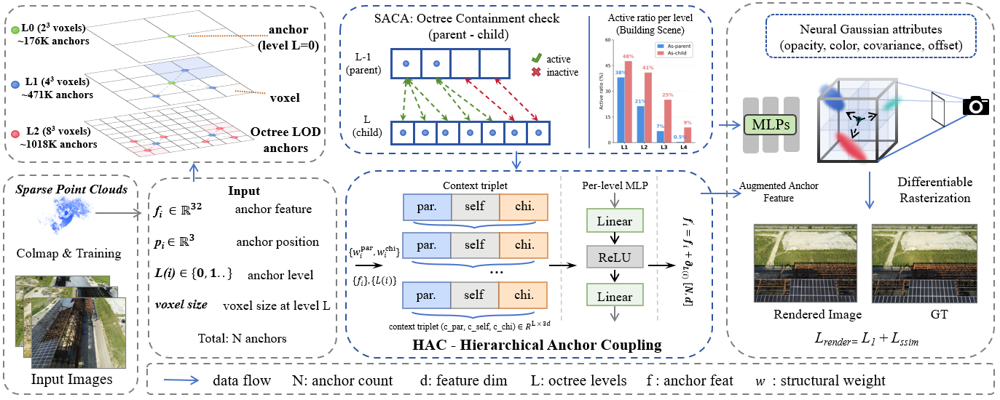
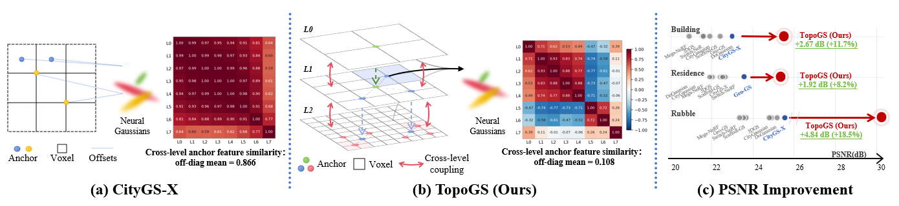

<div align="center">

# TopoGS: Topology-Aware Anchor Feature Aggregation for Large-Scale 3D Gaussian Splatting

Northwestern Polytechnical University; Université Gustave Eiffel / IGN

Wei Zhang, Shiqiang Gong, Shengkai Yu, Zeyu Wang, Clement Mallet, Zhitong Xiong, and Qi Wang<sup>†</sup>

<sup>†</sup> indicates corresponding author

**Topology-aware cross-level anchor feature aggregation for large-scale 3D Gaussian Splatting.**



<sub><b>Method overview.</b> TopoGS introduces HAC and SACA between the octree-anchor backbone and the Neural Gaussian decoder.</sub>

</div>

This repository contains the official implementation of **TopoGS**, a topology-aware anchor feature aggregation framework for large-scale 3D Gaussian Splatting.

TopoGS builds on an octree-anchor 3DGS backbone and enhances anchor features with two lightweight modules: **Hierarchical Anchor Coupling (HAC)** establishes cross-level gradient pathways through per-level parent-self-child context triplets, while **Structure-Aware Containment Aggregation (SACA)** uses octree containment to softly weight topologically connected cross-level anchors.

<div align="center">


<sub><b>Overview highlights.</b> TopoGS reorganizes cross-level anchor features and improves PSNR across large-scale scenes.</sub>
</div>

## Results

The following tables summarize selected results from the paper. CityGS-X is the direct octree-anchor backbone baseline used to evaluate the contribution of TopoGS.

### Main Quantitative Results

| Benchmark Group | Scenes | Avg. PSNR Gain vs. CityGS-X | Best Scene Gain | Highlight |
| --- | ---: | ---: | ---: | --- |
| Mill19 + UrbanScene3D | 4 | **+3.61 dB** | **+4.84 dB** on Rubble | Large-scale aerial scenes |
| Tanks & Temples | 2 | **+1.91 dB** | **+1.93 dB** on Truck | Ground-level outdoor scenes |
| MatrixCity + WHU | 4 | **+1.44 dB** | **+2.39 dB** on WHU-Area 4 | Synthetic and cartographic aerial scenes |

Full per-scene quantitative results are reported in the paper.

### Component Ablation

Results are reported on the Mill19-Building scene.

| ID | HAC | SACA Mask | Soft Alpha | PSNR | Training Time |
| --- | --- | --- | --- | ---: | ---: |
| 1 | &ndash; | &ndash; | &ndash; | 22.76 | 2h15m |
| 2 | &#10003; | &ndash; | &ndash; | 24.67 | 2h22m |
| 3 | &#10003; | &#10003; | &ndash; | 25.23 | 2h28m |
| **4** | **&#10003;** | **&#10003;** | **&#10003;** | **25.43** | **2h30m** |

### Inference Efficiency

Results are measured on Mill19-Building with a single RTX 4090.

| Method | FPS | GPU Memory | Neural Gaussians |
| --- | ---: | ---: | ---: |
| CityGS-X | 29.0 | 4.6 GB | 6.38 M |
| TopoGS (Ours) | **39.4** | **3.0 GB** | **4.16 M** |

## Updates

- 2026-06-30: Initial training, rendering, and evaluation code release.

## Todo List

- [x] Release training, rendering, and evaluation code.
- [ ] Release pretrained checkpoints.
- [ ] Release links for partially processed datasets.
- [ ] Release a more detailed dataset preprocessing guide.
- [ ] Add arXiv and project-page links when available.

## Installation

The code was developed with Python 3.8, PyTorch 2.0, and CUDA 11.8. Similar CUDA-enabled Linux environments should work, but may require small dependency adjustments.

```bash
git clone https://github.com/WZ-CS/TopoGS.git
cd TopoGS

conda env create -f environment.yml
conda activate topogs

pip install submodule_cityx/diff-gaussian-rasterization
pip install submodule_cityx/simple-knn
```

## Depth Preparation

TopoGS can use monocular depth priors for real-world datasets. We do not vendor Depth-Anything-V2 in this repository. Install it externally and download its checkpoint from the official project:

```bash
git clone https://github.com/DepthAnything/Depth-Anything-V2.git
cd Depth-Anything-V2
```

Download the Depth-Anything-V2-Large checkpoint following the official instructions, then generate grayscale depth maps:

```bash
python run.py --encoder vitl --pred-only --grayscale \
  --img-path /path/to/images \
  --outdir /path/to/depths
```

Create depth scale parameters:

```bash
python utils/make_depth_scale.py \
  --base_dir /path/to/scene \
  --depths_dir /path/to/depths
```

For multi-view filtering:

```bash
python multi_view_precess.py \
  -s /path/to/scene \
  --resolution 4 \
  --model_path /path/to/scene/train/mask \
  --images train/rgbs \
  --pixel_thred 1
```

## Data

Datasets are not included in this repository. We evaluate on public benchmarks used in the paper:

- Mill19
- UrbanScene3D
- Tanks & Temples
- MatrixCity
- WHU

Prepare each scene in a COLMAP-compatible layout. For Mill19, UrbanScene3D, Tanks & Temples, and WHU-style real-world scenes, the expected layout is:

```text
datasets/<scene_name>/
├── train/
│   ├── rgbs/
│   ├── depths/
│   └── mask/
├── val/
│   └── rgbs/
└── sparse/
    └── 0/
```

For MatrixCity aerial scenes, the expected layout is:

```text
datasets/MatrixCity/aerial/small_city/aerial/
├── train/block_all/
│   ├── images/
│   ├── depth/
│   ├── mask/
│   └── sparse/0/
└── test/block_all_test/
    ├── images/
    └── sparse/0/
```

## Training

Single-scene training example:

```bash
torchrun --standalone --nnodes=1 --nproc-per-node=4 train.py \
  --bsz 8 \
  -s datasets/mill19/building \
  --resolution 4 \
  --model_path output/mill19_building_topogs \
  --iterations 100000 \
  --images train/rgbs \
  --single_view_weight_from_iter 10000 \
  --depth_l1_weight_final 0.01 \
  --depth_l1_weight_init 0.5 \
  --dpt_loss_from_iter 10000 \
  --dpt_end_iter 30000 \
  --scale_loss_from_iter 0 \
  --multi_view_weight_from_iter 30000 \
  --default_voxel_size 0.001
```

Benchmark script templates are provided under `scripts/`:

```bash
bash scripts/train_mill19.sh datasets/mill19/building output/mill19_building_topogs
bash scripts/train_urbanscene3d.sh datasets/urbanscene3d/residence output/urbanscene3d_residence_topogs
bash scripts/train_tanks_temples.sh datasets/tanks_temples/train output/tanks_temples_train_topogs
bash scripts/train_matrixcity.sh datasets/MatrixCity/aerial/small_city/aerial/train/block_all output/matrixcity_topogs
bash scripts/train_whu.sh datasets/WHU/area1 output/whu_area1_topogs
```

## Rendering And Evaluation

Render held-out views:

```bash
bash scripts/render.sh datasets/mill19/building output/mill19_building_topogs
```

Compute image metrics:

```bash
bash scripts/eval_metrics.sh output/mill19_building_topogs
```

Extract a mesh:

```bash
bash scripts/extract_mesh.sh datasets/mill19/building output/mill19_building_topogs
```

Compute F1 score for reconstructed meshes:

```bash
bash scripts/eval_f1.sh output/mill19_building_topogs/possion_mesh/tsdf_fusion.ply datasets/mill19/building/tsdf_fusion.ply
```

## Acknowledgements

This project builds on and benefits from the following works and codebases:

- 3D Gaussian Splatting by GraphDECO/Inria
- Scaffold-GS
- Octree-GS
- CityGS-X
- CityGaussian and CityGaussianV2
- PGSR
- Geo-GS
- Depth-Anything-V2

Please also follow the licenses and terms of the upstream projects and datasets.
